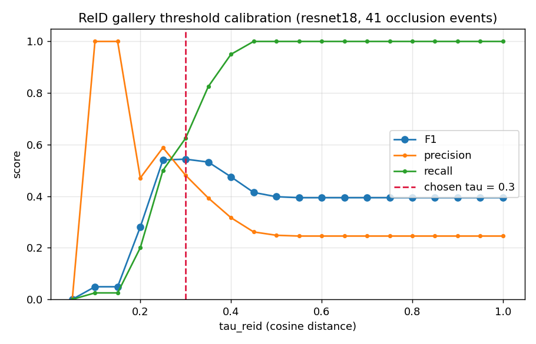

# ReID Gallery Threshold Calibration (PRD §9.4)

*Generated 2026-09-01T06:17:39+00:00*

## Provenance

| Key                | Value                                                                                                                                                                                                                                                                        |
|--------------------|------------------------------------------------------------------------------------------------------------------------------------------------------------------------------------------------------------------------------------------------------------------------------|
| config fingerprint | f0a93d2104cf                                                                                                                                                                                                                                                                 |
| git commit         | a37bb45                                                                                                                                                                                                                                                                      |
| split              | trainval                                                                                                                                                                                                                                                                     |
| videos             | scene01_camA.mp4, scene02_camA.mp4, scene03_camA.mp4, scene05_camA.mp4, scene06_camA.mp4, scene06_camB.mp4, scene08_camA.mp4, scene09_camA.mp4, scene10_camA.mp4, scene11_camA.mp4, scene12_camA.mp4, scene14_camA.mp4, scene15_camA.mp4, scene16_camA.mp4, scene16_camB.mp4 |

## Chosen threshold

| Key               | Value    |
|-------------------|----------|
| tau_reid          | 0.3      |
| F1 at tau         | 0.5435   |
| ReID backend      | resnet18 |
| occlusion events  | 41       |
| candidate pairs   | 163      |
| calibration split | trainval |

## Sweep

| tau  | TP | FP (identity merge) | FN (new id issued) | precision | recall | F1    |
|------|----|---------------------|--------------------|-----------|--------|-------|
| 0.05 | 0  | 0                   | 40                 | 0.000     | 0.000  | 0.000 |
| 0.10 | 1  | 0                   | 39                 | 1.000     | 0.025  | 0.049 |
| 0.15 | 1  | 0                   | 39                 | 1.000     | 0.025  | 0.049 |
| 0.20 | 8  | 9                   | 32                 | 0.471     | 0.200  | 0.281 |
| 0.25 | 20 | 14                  | 20                 | 0.588     | 0.500  | 0.540 |
| 0.30 | 25 | 27                  | 15                 | 0.481     | 0.625  | 0.543 |
| 0.35 | 33 | 51                  | 7                  | 0.393     | 0.825  | 0.532 |
| 0.40 | 38 | 82                  | 2                  | 0.317     | 0.950  | 0.475 |
| 0.45 | 40 | 113                 | 0                  | 0.261     | 1.000  | 0.414 |
| 0.50 | 40 | 121                 | 0                  | 0.248     | 1.000  | 0.398 |
| 0.55 | 40 | 123                 | 0                  | 0.245     | 1.000  | 0.394 |
| 0.60 | 40 | 123                 | 0                  | 0.245     | 1.000  | 0.394 |
| 0.65 | 40 | 123                 | 0                  | 0.245     | 1.000  | 0.394 |
| 0.70 | 40 | 123                 | 0                  | 0.245     | 1.000  | 0.394 |
| 0.75 | 40 | 123                 | 0                  | 0.245     | 1.000  | 0.394 |
| 0.80 | 40 | 123                 | 0                  | 0.245     | 1.000  | 0.394 |
| 0.85 | 40 | 123                 | 0                  | 0.245     | 1.000  | 0.394 |
| 0.90 | 40 | 123                 | 0                  | 0.245     | 1.000  | 0.394 |
| 0.95 | 40 | 123                 | 0                  | 0.245     | 1.000  | 0.394 |
| 1.00 | 40 | 123                 | 0                  | 0.245     | 1.000  | 0.394 |

## Reading this

A **false positive** here is an identity *merge*: two different objects collapsed into one id. A **false negative** is a genuine return rejected, which issues a new id and inflates the unique count. F1 balances the two; the curve is published so the shape, not only the argmax, is auditable.

